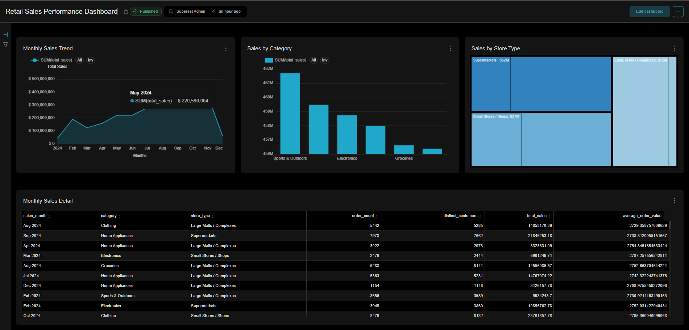
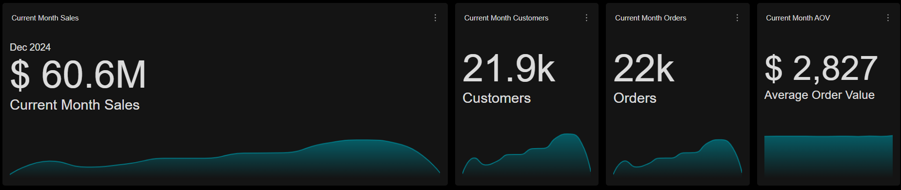
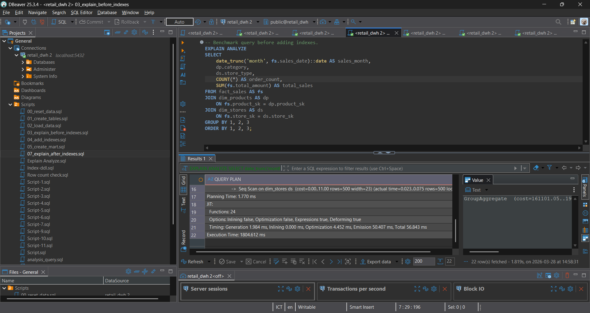
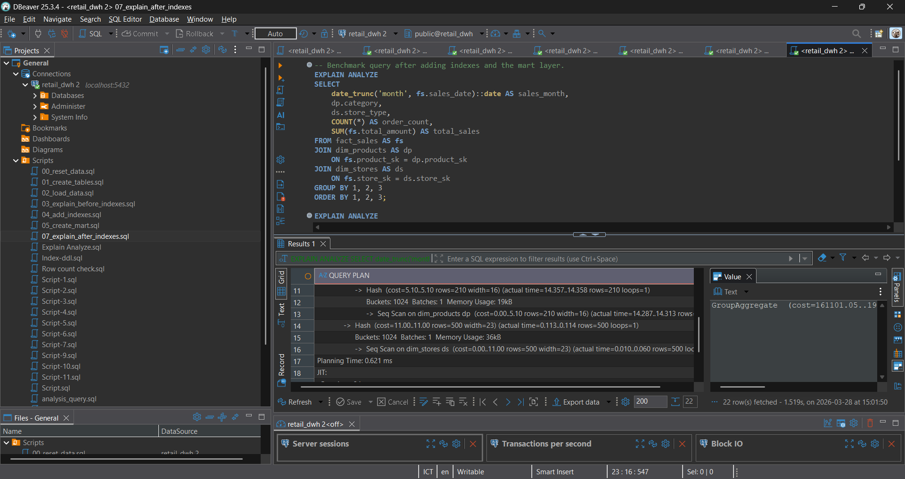

# Retail DWH

Production-style retail data warehouse project built with PostgreSQL, Docker Compose, Great Expectations, and Apache Superset.


## Overview

This project demonstrates an end-to-end retail DWH workflow:

- create dimension and fact tables in PostgreSQL
- load CSV source data into the warehouse
- optimize analytical queries with indexes and query plan checks
- expose a read-only BI user for visualization tools
- build a mart layer for aggregated reporting
- validate data quality with Great Expectations
- provision a starter dashboard in Apache Superset
- generate Data Docs as validation output

## Conclusion

This project shows how a retail analytics stack can be made reproducible, query-efficient, and BI-ready from a single Docker-based workflow.

Key takeaways:

- the warehouse uses a star-schema layout, with `fact_sales` for transactions and dimension tables for business context
- a reporting mart, `mart.monthly_sales`, simplifies recurring BI queries and makes dashboard consumption lighter
- indexing on join keys and `sales_date` improves access paths for analytical queries against the fact table
- `EXPLAIN ANALYZE` scripts document the difference between querying the base fact table and querying the aggregated mart layer
- the final dashboard turns the warehouse into business-facing outputs such as current-month KPIs, monthly sales trend, category comparison, and store-type contribution

In short, the project is not only about loading data into PostgreSQL, but also about showing how data modeling, indexing, and mart design work together to improve analytics performance and usability.

## Dashboard Preview

This repository also includes a curated monthly sales reporting dashboard built on top of the warehouse and mart layer.

The dashboard is intended to show:

- current month KPI snapshot
- monthly sales trend
- category contribution to sales
- store type contribution to sales
- detailed monthly sales records

Dashboard title:

- `Retail Sales Performance Dashboard`

Chart names:

- `Current Month Sales`
- `Current Month Orders`
- `Current Month Customers`
- `Current Month AOV`
- `Monthly Sales Trend`
- `Sales by Category`
- `Sales by Store Type`
- `Monthly Sales Detail`

Dashboard preview:



KPI snapshot:



## Business Insights

The dashboard is designed to produce practical monthly business insights from the `mart.monthly_sales` layer.

Examples from the current dashboard build:

- the latest month in the sample dashboard is `Dec 2024`
- current month sales are approximately `60.6M`
- current month orders are approximately `22K`
- current month customers are approximately `21.9K`
- current month AOV is approximately `2,827`
- sales trend rises through most of the year, peaks around `Oct 2024`, and declines in `Dec 2024`
- `Sports & Outdoors` is the top sales category in the current category comparison
- `Supermarkets` is the highest-contributing store type in the current store-type comparison

The dashboard directly helps answer questions such as:

- What is the latest monthly sales performance?
- Is the business trending upward or downward over time?
- Which categories contribute the most to revenue?
- Which store types contribute the most to revenue?
- What detailed monthly records support the summary charts?

## Architecture

Architecture diagram:

- [docs/architecture.md](docs/architecture.md)

## What This Project Demonstrates

- star-schema warehouse modeling for analytical workloads
- reproducible local orchestration with Docker Compose
- data quality validation with Great Expectations
- performance optimization using indexes and query plan inspection
- BI delivery through a reporting mart and Apache Superset dashboarding

## Repository Highlights

- star-schema warehouse with `fact_sales` and supporting dimensions for analytical joins
- indexed fact table to improve repeated join and date-based query patterns
- mart-based BI dashboard built on `mart.monthly_sales` for lighter reporting queries

## Stack

- PostgreSQL 16
- Docker Compose
- Python 3.11
- Great Expectations 0.18.21
- Apache Superset 6.0.0

## Features

- Dockerized PostgreSQL warehouse with custom `postgres.conf`
- SQL bootstrap scripts for schema, load, performance tuning, mart, and RBAC
- `bi_viewer` read-only role for BI access
- `mart.monthly_sales` materialized view for reporting
- Great Expectations validation and Data Docs generation
- Superset auto-provisioning for database connection, dataset, chart, and dashboard

## Project Structure

```text
retail_dwh/
|-- config/
|-- data/
|-- docs/
|-- great_expectations/
|-- gx/
|-- scripts/
|-- sql/
|-- superset/
|-- tests/
|-- .env.example
|-- docker-compose.yml
`-- setup_datasource.py
```

## Prerequisites

- Docker Desktop
- Docker Compose

Optional:

- DBeaver or another SQL client if you want to inspect the database with a GUI

## Dataset Source

This repository does not include the raw CSV files.

Download the dataset from Kaggle:

- [Retail Store Star Schema Dataset | Kaggle](https://www.kaggle.com/datasets/shrinivasv/retail-store-star-schema-dataset)

Expected CSV files:

- `dim_campaigns.csv`
- `dim_customers.csv`
- `dim_dates.csv`
- `dim_products.csv`
- `dim_salespersons.csv`
- `dim_stores.csv`
- `fact_sales_normalized.csv`

## Environment Setup

Copy `.env.example` to `.env` and adjust the values if needed.

Example:

```powershell
Copy-Item .env.example .env
```

Important variables:

- `POSTGRES_USER`
- `POSTGRES_PASSWORD`
- `POSTGRES_DB`
- `POSTGRES_PORT`
- `GX_CONTEXT_ROOT`
- `DATA_DIR`
- `SUPERSET_PORT`
- `SUPERSET_SECRET_KEY`
- `SUPERSET_ADMIN_USERNAME`
- `SUPERSET_ADMIN_PASSWORD`
- `SUPERSET_METADATA_DB`

`DATA_DIR` must point to the folder containing the Kaggle CSV files.

Examples:

- if the CSVs are inside `retail_dwh/data`, use `DATA_DIR=./data`
- if the CSVs are stored one level above, use `DATA_DIR=../data`

## How To Run

Build and start the stack:

```powershell
docker compose up -d --build
```

Run Great Expectations validation:

```powershell
docker compose run --rm gx python setup_datasource.py
```

First-time flow:

```powershell
Copy-Item .env.example .env
docker compose up -d --build
docker compose run --rm gx python setup_datasource.py
```

Check running services:

```powershell
docker compose ps
```

Stop the stack:

```powershell
docker compose down
```

Remove containers and database volume:

```powershell
docker compose down -v
```

## Warehouse Design Insights

### DDL and Data Modeling Insights

The warehouse schema follows a star-schema style layout:

- `fact_sales` stores transactional sales events
- dimension tables such as `dim_customers`, `dim_products`, and `dim_stores` provide business context
- `mart.monthly_sales` provides a reporting-ready aggregated layer for BI consumption

This design gives several practical benefits:

- separates raw transactional facts from descriptive business dimensions
- makes analytical joins easier to understand and maintain
- supports both low-level analysis from the fact table and high-level reporting from the mart layer
- keeps BI queries simpler because common monthly aggregations are precomputed in the mart

Practical takeaway:
- the DDL is not only creating tables, but shaping how business questions can be answered efficiently and consistently

### Indexing and Query Performance Insights

The project includes explicit indexing on important columns in `fact_sales`, especially:

- `product_sk`
- `customer_sk`
- `store_sk`
- `salesperson_sk`
- `campaign_sk`
- `sales_date`

These indexes help because analytical queries frequently:

- join `fact_sales` to dimension tables through foreign keys
- filter or group results by date
- aggregate large numbers of rows from the fact table

Without indexes, PostgreSQL is more likely to rely on broader scans when resolving joins or locating date-based slices of data.
With indexes in place, the planner can access join and filter columns more efficiently, which reduces query cost for repeated analytical access patterns.

This repository shows that idea in two ways:

- `03_explain_before_indexes.sql` captures query behavior before additional indexes
- `07_explain_after_indexes.sql` captures query behavior after indexing and after introducing the mart layer

In practice, the biggest performance gain in this project comes from combining both strategies:

- indexing the transactional fact table for faster base-table access
- creating `mart.monthly_sales` so recurring BI queries read a much smaller pre-aggregated dataset

That is why dashboard queries against `mart.monthly_sales` are much lighter than repeating the full aggregation from `fact_sales` every time.

Practical takeaway:
- indexing improves repeated joins and date-based access on the fact table, while the mart layer reduces the amount of data scanned by BI queries altogether

Query plan comparison:

Before indexing:



After indexing and mart usage:



## Trade-offs

- the current mart is monthly, so the dashboard is intentionally focused on monthly monitoring rather than daily operational analysis
- daily trend analysis would be better served by an additional mart such as `mart.daily_sales`
- the raw dataset is intentionally excluded from the repository, so reproducibility depends on downloading the Kaggle source files separately
- `02_load_data.sql` is designed for bootstrap loading, not for repeated manual execution without resetting existing table contents

## Key SQL Assets

- [01_create_tables.sql](/e:/Project/Projects/retail-dwh-prodready/retail_dwh/sql/01_create_tables.sql) defines the warehouse DDL for dimension and fact tables
- [04_add_indexes.sql](/e:/Project/Projects/retail-dwh-prodready/retail_dwh/sql/04_add_indexes.sql) adds the main indexing strategy for analytical access
- [05_create_mart.sql](/e:/Project/Projects/retail-dwh-prodready/retail_dwh/sql/05_create_mart.sql) creates the reporting mart `mart.monthly_sales`
- [07_explain_after_indexes.sql](/e:/Project/Projects/retail-dwh-prodready/retail_dwh/sql/07_explain_after_indexes.sql) captures post-optimization query-plan review

## Visualization

Superset runs at:

- `http://localhost:8088`

Default access comes from your `.env` values:

- username: `SUPERSET_ADMIN_USERNAME`
- password: `SUPERSET_ADMIN_PASSWORD`

The stack automatically provisions:

- a warehouse connection named `warehouse_bi_viewer`
- a dataset for `mart.monthly_sales`
- a starter chart named `Monthly Sales Mart Table`
- a dashboard named `Retail Sales Performance Dashboard`

The warehouse connection uses the read-only `bi_viewer` role defined in `.env`.

Reporting objects:

- warehouse fact table: `public.fact_sales`
- reporting mart: `mart.monthly_sales`

## Validation Output

When validation succeeds, the project will:

- create the expectation suite
- create the checkpoint
- run validation against `public.fact_sales`
- generate Data Docs

Data Docs location:

`great_expectations/uncommitted/data_docs/local_site/index.html`

## Operational Notes

- [00_reset_data.sql](/e:/Project/Projects/retail-dwh-prodready/retail_dwh/sql/00_reset_data.sql) is intended for manual reruns before re-executing the load script from DBeaver or another SQL client
- [02_load_data.sql](/e:/Project/Projects/retail-dwh-prodready/retail_dwh/sql/02_load_data.sql) is not idempotent, so reruns without resetting table contents will cause duplicate-key errors
- use the `bi_viewer` credentials for BI and read-only access, and reserve the admin-level Postgres user for setup and maintenance tasks

## Future Improvements

- add a `mart.daily_sales` layer for daily trend and operational analysis
- add CI checks for SQL linting, config validation, and smoke-test execution
- extend Great Expectations coverage beyond the current fact-table validation set
- deploy the Superset stack to a public environment for live portfolio access
- add native Superset filters and more advanced MoM/YoY comparison metrics

## Docker Path Contract

This repository is intentionally designed to run through Docker Compose.

- the project root is mounted to `/app` inside the `gx` container
- the data directory is mounted to `/data` inside the Postgres container
- SQL loading uses `COPY FROM '/data/...csv'`
- Great Expectations defaults to `GX_CONTEXT_ROOT=/app/great_expectations`
- Superset reads its local config from `superset/superset_config.py`

These are container paths, not machine-specific local paths.

## Notes

- `gx` is a utility container, not a long-running service, so use `docker compose run --rm gx ...`
- `.env` should stay local and should not be pushed to GitHub
- generated files under `great_expectations/uncommitted/` are local artifacts unless you explicitly want to publish them
- the dataset is intentionally excluded from version control; users must download it separately from Kaggle
- Superset uses a dedicated metadata database named by `SUPERSET_METADATA_DB`
- Superset startup provisions dashboard assets automatically on container boot

## Optional Database Check

Open a psql session:

```powershell
docker compose exec postgres psql -U <your_postgres_user> -d <your_postgres_db>
```

Example queries:

```sql
SELECT COUNT(*) FROM fact_sales;
SELECT * FROM dim_products LIMIT 5;
SELECT * FROM mart.monthly_sales LIMIT 5;
```
