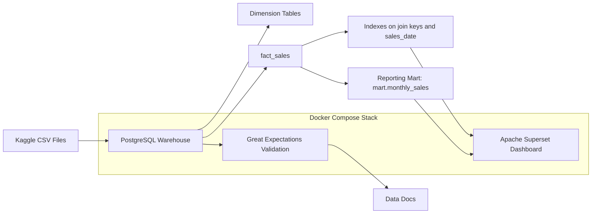

# Architecture Diagram

## Summary

The project flow is:

1. Raw CSV files are mounted into the Postgres container.
2. SQL bootstrap scripts create the warehouse schema and load the source data.
3. Indexes improve access paths on the transactional fact table.
4. `mart.monthly_sales` materializes reporting-ready monthly aggregates.
5. Great Expectations validates warehouse quality and generates Data Docs.
6. Apache Superset connects through the read-only `bi_viewer` user and serves dashboard visualizations.
